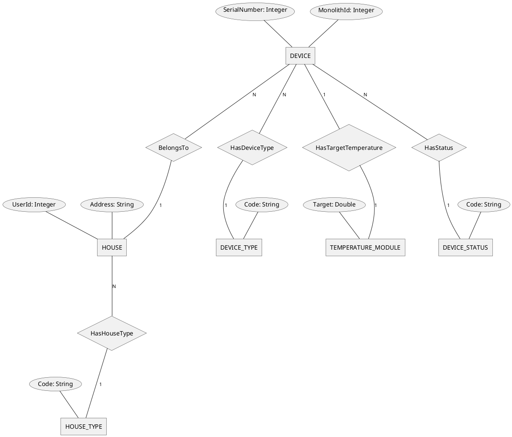

```puml
@startchen

entity DEVICE {
    SerialNumber: Integer
    MonolithId: Integer
}
entity HOUSE {
    Address: String
    UserId: Integer
}

entity DEVICE_TYPE {
    Code: String
}

entity DEVICE_STATUS {
    Code: String
}

entity HOUSE_TYPE {
    Code: String
}

entity TEMPERATURE_MODULE {
    Target: Double
}

relationship BelongsTo {
}

relationship HasDeviceType {
}

relationship HasTargetTemperature {
}

relationship HasHouseType {
}

relationship HasStatus {
}

DEVICE -N- BelongsTo
BelongsTo -1- HOUSE

DEVICE -N- HasDeviceType
HasDeviceType -1- DEVICE_TYPE

DEVICE -N- HasStatus
HasStatus -1- DEVICE_STATUS

HOUSE -N- HasHouseType
HasHouseType -1- HOUSE_TYPE

DEVICE -1- HasTargetTemperature
HasTargetTemperature -1- TEMPERATURE_MODULE
@endchen
``` 