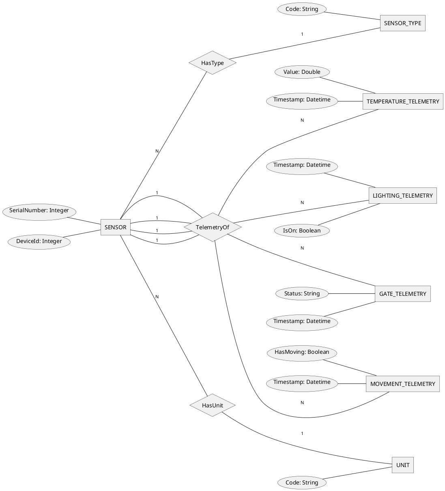

```puml
@startchen

left to right direction

entity SENSOR {
    SerialNumber: Integer
    DeviceId: Integer
}
entity UNIT{
    Code: String
}

entity SENSOR_TYPE {
    Code: String
}

entity TEMPERATURE_TELEMETRY {
    Value: Double
    Timestamp: Datetime
}

entity LIGHTING_TELEMETRY {
    IsOn: Boolean
    Timestamp: Datetime
}

entity GATE_TELEMETRY {
    Status: String
    Timestamp: Datetime
}

entity MOVEMENT_TELEMETRY {
    HasMoving: Boolean
    Timestamp: Datetime
}

relationship HasType {
}

relationship TelemetryOf {
}

relationship HasUnit {
}

SENSOR -N- HasType
HasType -1- SENSOR_TYPE

SENSOR -N- HasUnit
HasUnit -1- UNIT

SENSOR -1- TelemetryOf
TelemetryOf -N- TEMPERATURE_TELEMETRY

SENSOR -1- TelemetryOf
TelemetryOf -N- LIGHTING_TELEMETRY

SENSOR -1- TelemetryOf
TelemetryOf -N- GATE_TELEMETRY

SENSOR -1- TelemetryOf
TelemetryOf -N- MOVEMENT_TELEMETRY
@endchen
``` 