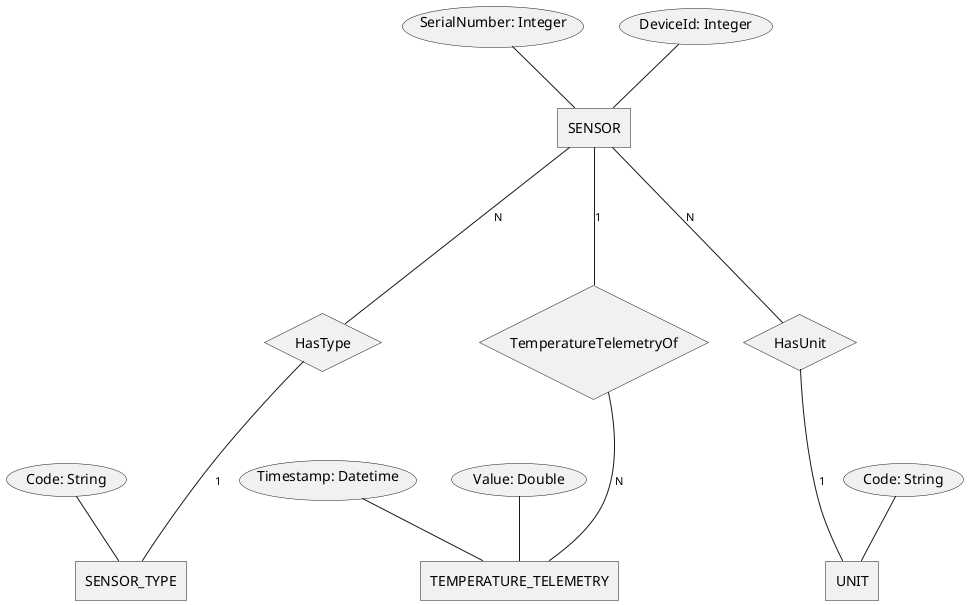

```puml
@startchen

entity SENSOR {
    SerialNumber: Integer
    DeviceId: Integer
}
entity UNIT{
    Code: String
}

entity SENSOR_TYPE {
    Code: String
}

entity TEMPERATURE_TELEMETRY {
    Value: Double
    Timestamp: Datetime
}

relationship HasType {
}

relationship TemperatureTelemetryOf {
}

relationship HasUnit {
}

SENSOR -N- HasType
HasType -1- SENSOR_TYPE

SENSOR -N- HasUnit
HasUnit -1- UNIT

SENSOR -1- TemperatureTelemetryOf
TemperatureTelemetryOf -N- TEMPERATURE_TELEMETRY
@endchen
``` 