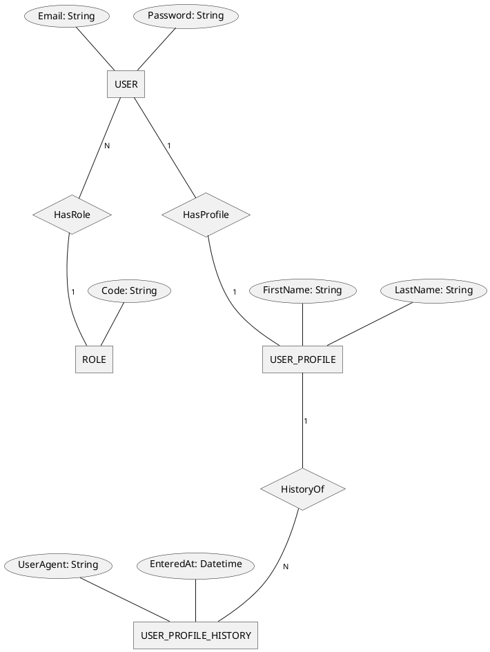

```puml
@startchen

entity USER {
    Email: String
    Password: String
}
entity ROLE{
    Code: String
}

entity USER_PROFILE {
    FirstName: String
    LastName: String
}

entity USER_PROFILE_HISTORY {
    UserAgent: String
    EnteredAt: Datetime
}

relationship HasRole {
}

relationship HistoryOf {
}

relationship HasProfile {
}

USER -N- HasRole
HasRole -1- ROLE

USER -1- HasProfile
HasProfile -1- USER_PROFILE

USER_PROFILE -1- HistoryOf
HistoryOf -N- USER_PROFILE_HISTORY
@endchen
``` 